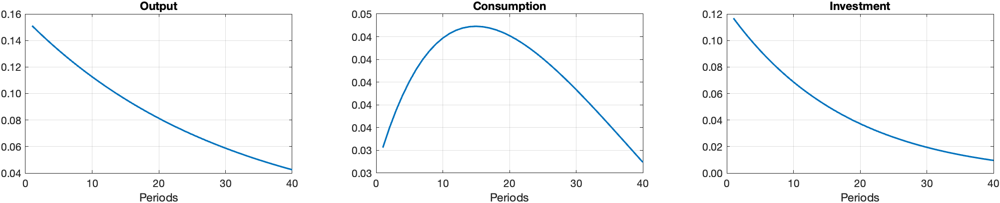
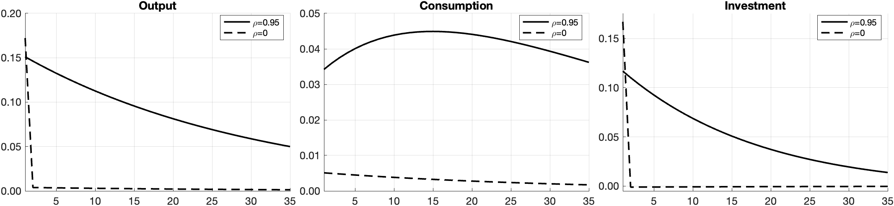

# DSGE building blocks in Dynare

Small, self-contained Dynare models that I wrote while learning how the standard
New Keynesian and real business cycle models change when one adds features one at
a time. I use them as teaching material for the master tutorials in Advanced
Macroeconomics and Monetary Policy at Kiel University.

Requirements: MATLAB and Dynare (written with Dynare 5.x). The `rbc/rbc.gmod`
file additionally needs the [GDSGE](https://www.gdsge.com) toolbox.

## `nk/` — New Keynesian models

A sequence that starts from the three-equation model and adds one block per file.

| File | Adds | Notes |
|---|---|---|
| `baselineNK.mod` | — | Three-equation NK model (IS curve, Phillips curve, Taylor rule), monetary policy shock |
| `baselineNK1.mod` | Government, lump-sum tax | Spending follows an AR(1) |
| `baselineNK1b.mod` | Government, consumption tax | |
| `baselineNK2.mod` | Endogenous labour market | Household labour supply, production without capital |
| `baselineNK3.mod` | Labour market + government, lump-sum tax | Nonlinear specification |
| `baselineNK3b.mod` | Labour market + government, consumption tax | Linear specification |
| `baselineNK4.mod` | Labour market + government, labour-income tax | |
| `baselineNK6.mod` | Long-term rate, term premium, QE | Term-premium and QE shocks |
| `baselineNK6b.mod` | Interest on reserves, QE-compressed loan spread | Supply shock |
| `baselineNK_diff_price_stickiness.mod` | Calvo parameter read from the workspace | Used by the comparison script below |

Scripts:

- `run_baselineNK.m` — runs a chosen variant (uncomment the line you want).
- `run_BaselineNK_diff_price_stickiness.m` — solves the three-equation model for
  several degrees of price stickiness (Calvo parameter ω = 0.25, 0.67, 0.9), checks
  the Taylor-principle determinacy condition for each, and collects the impulse
  responses to demand and supply shocks.
- `plot_comparison.m` — plots those responses side by side.

## `rbc/` — Real business cycle model

- `baselineRBC.mod` — standard RBC model with a persistent technology shock
  (ρ = 0.95), with investment, hours, wage and real interest rate.
- `baselineRBC_tempShock.mod` — same model with a purely temporary shock (ρ = 0),
  to show the role of persistence.
- `baselineRBC.m` — runs the model and plots the impulse responses of output,
  consumption and investment.
- `rbc.gmod` — the same economy solved globally with time iteration in GDSGE,
  with a two-state Markov technology process.




## Running

```matlab
addpath('<your-dynare-folder>/matlab')
cd nk
dynare baselineNK
```

Dynare writes its generated folders (`+model/`, `model/`), logs and `.mat` files
next to the `.mod` file; they are ignored by git.

## Author

Alicia Pita Marcet, PhD candidate in Quantitative Economics, Kiel University.
